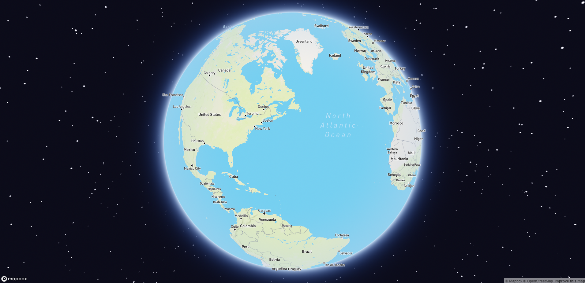

# Vue 3 + Mapbox + Typescript + Vite


## Description

Mapbox Globe with Vue 3

### Some Screenshots

<div align="center" width="100%">
      
</div> 

### 🔧 Installation (ESLint + Prettier)

* 🚨 It is not necessary, since when the project is cloned and **yarn** is executed it is installed, it is to have it as
  a reference for future projects

``` 
yarn add -D @typescript-eslint/eslint-plugin @typescript-eslint/parser @vue/eslint-config-typescript eslint-config-prettier eslint eslint-plugin-prettier eslint-plugin-vue vue-eslint-parser prettier
```

## Expressions of Gratitude 🎁

* I am very grateful for everything I learned in the
  course [Vue.js: Mapbox Globe - Ejercicio Básico](https://www.youtube.com/watch?v=77N5PAS5cXE) made
  by [Fernando Herrera](https://fernando-herrera.com)

---
⌨️ with ❤️by [gcristia](https://github.com/gcristia) 😊
